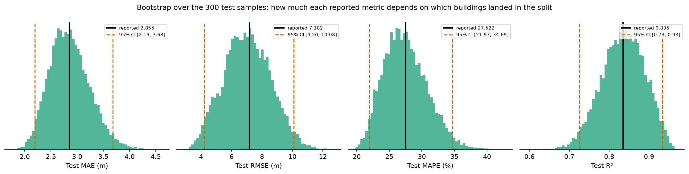

# Astana Building Height Estimation

[](https://github.com/tasadilet-ctrl/astana-building-heights/actions/workflows/ci.yml)

Predicting building height (in meters) directly from a single satellite image tile, using a fine-tuned ConvNeXt-Base regression model over ~6,000 labeled locations across Astana, Kazakhstan.

## Approach

- **Backbone:** ConvNeXt-Base (ImageNet-pretrained), with a custom regression head (adaptive pool → dropout → linear → GELU → dropout → linear)
- **Training:** backbone frozen for the first 5 epochs (head-only warmup), then unfrozen with a 10x lower LR; AdamW + cosine annealing LR schedule; Huber loss (delta=3.0); early stopping on validation MAE
- **Data:** 5,998 satellite image tiles (384×384) paired with ground-truth building heights (2.5m–307.1m, median 6.4m), split 5,398 train / 300 val / 300 test

## Results

| Metric | Value |
|---|---|
| Test MAE | **2.83 m** |
| Test RMSE | 5.93 m |
| Test R² | 0.887 † |
| Test MAPE | 29.8% |

† Every metric here carries substantial sampling uncertainty on a 300-sample test set — MAE's 95% bootstrap CI is [2.19, 3.68] m. See [Evaluation uncertainty](#evaluation-uncertainty).

MAE by height bucket (test set):

| Height range | MAE | n |
|---|---|---|
| 0–5 m | 1.45 m | 102 |
| 5–10 m | 1.77 m | 122 |
| 10–20 m | 3.92 m | 20 |
| 20–50 m | 4.46 m | 44 |
| 50–200 m | 17.56 m | 12 |

## Reproduction

The numbers above come from the original notebook run. To check that the extracted package (below) still reproduces them, the whole thing was retrained from scratch on a different GPU — an RTX PRO 6000 Blackwell rather than the original machine — with identical hyperparameters and split. Full log: [`benchmarks/reproduction_run.log`](benchmarks/reproduction_run.log).

| Metric | Original | Reproduction | Δ |
|---|---|---|---|
| Best Val MAE | 1.94 m | 1.96 m | +1.0% |
| **Test MAE** | **2.830 m** | **2.855 m** | **+0.9%** |
| Test MAPE | 29.8% | 27.5% | better |
| Test RMSE | 5.93 m | 7.18 m | +21% |
| Test R² | 0.887 | 0.835 | −6% |

Validation MAE tracked the original within 0.06 m from epoch 50 onward (2.18 vs 2.12 at 50, exactly 2.13 at 55, 2.08 vs 2.03 at 60). The runs aren't bit-identical — dataloader shuffling, augmentation RNG and cuDNN nondeterminism all differ, and this run used all 80 epochs where the original early-stopped at 78 — but the headline MAE lands within 1%.

### Why the squared-error metrics moved more

MAE matched to 0.9% while RMSE moved 21% and R² 6%. RMSE and R² weight residuals *quadratically*, so they are far more sensitive to the handful of predictions that differ most between runs — and those are the tall buildings, which are the rarest and hardest cases. MAE weights the same disagreements linearly, so it absorbs them.

That is a statement about **run-to-run** variance on a fixed test set. How much each number depends on the test set itself is a separate question, measured below.

## Evaluation uncertainty

Rather than leave "these numbers are shaky" as an impression, [`scripts/evaluate_uncertainty.py`](scripts/evaluate_uncertainty.py) measures it: it bootstraps the 300 test predictions (10,000 resamples) for a percentile confidence interval, and computes how far each metric moves when a single sample is removed.

It runs on CPU from [`benchmarks/test_predictions.csv`](benchmarks/test_predictions.csv) — 300 committed rows — so these statistics are checkable with no GPU, no checkpoint and no dataset.



| Metric | Reported | 95% bootstrap CI | CI width / point | Worst single-sample swing |
|---|---|---|---|---|
| MAE | 2.855 m | [2.19, 3.68] | 52% | 8.3% |
| RMSE | 7.182 m | [4.20, 10.08] | 82% | 19.2% |
| MAPE | 27.5% | [21.9, 34.7] | 46% | 8.7% |
| R² | 0.835 | [0.73, 0.93] | 25% | 4.9% |

**No metric here is a three-significant-figure result.** With 300 test samples, MAE's 95% interval spans 2.19–3.68 m; the reported 2.855 is a point in a wide distribution. Removing one 126 m building alone moves RMSE by 19%.

### A correction

An earlier version of this README claimed R² and RMSE "rest on the 12 test samples above 50 m" while MAE was "the stable one." Measuring it shows that was wrong in a specific way.

Dropping all 12 tall buildings changes the metrics like this:

| Metric | All 300 | 288 (tall tail removed) |
|---|---|---|
| MAE | 2.855 m | 2.182 m (−24%) |
| RMSE | 7.182 m | 4.331 m (−40%) |
| R² | 0.8346 | 0.8357 (**+0.1%**) |

R² is almost perfectly *invariant* to removing the tall tail — the opposite of what was claimed. It is a ratio, `1 − SS_res/SS_tot`, and dropping the tall buildings shrinks SS_res by 2.86× and SS_tot by 2.84×, so the ratio barely moves. The absolute-error metrics, having no such denominator, fall sharply.

So the tall tail dominates the *magnitude* of MAE and RMSE, not the value of R². The original reasoning about run-to-run sensitivity (squared error amplifies disagreement on hard, rare samples) holds; the claim that R² depends on the tail's presence does not. It sounded plausible and went unmeasured for a day.

## Code layout

The experiment was originally a single notebook. [`satellite_heights.ipynb`](satellite_heights.ipynb) is kept as the record of the reported run — its committed output is where the numbers above come from — and the code has been extracted into a package so it can be imported, tested, and rerun without a notebook:

```
astana_heights/
  config.py     # hyperparameters, matching the reported run
  model.py      # ConvNeXtRegression + build_model()
  data.py       # dataset, augmentation, metadata filtering, 90/5/5 split
  evaluate.py   # MAE / RMSE / MAPE / R² and the per-bucket breakdown
train.py        # CLI training entry point
scripts/
  export_test_predictions.py  # GPU: checkpoint -> per-sample test predictions CSV
  evaluate_uncertainty.py     # CPU: bootstrap CIs + drop-one influence
  plot_uncertainty.py         # CPU: the bootstrap figure above
tests/          # CPU-only tests: no GPU, no dataset, no weight download
```

```bash
pip install -r requirements.txt
python3 train.py --data-dir /path/to/tiles --csv /path/to/metadata.csv
pytest tests/

# uncertainty analysis -- CPU only, runs from the committed predictions CSV
python3 scripts/evaluate_uncertainty.py
python3 scripts/plot_uncertainty.py
```

## What CI does and doesn't verify

The dataset isn't redistributable and the reported result took a long GPU run, so neither can be re-checked automatically. What CI does check on every push, on CPU, is that the code is wired correctly: the model emits one scalar per image, `load_metadata` drops failed scrapes and missing files, the split really is 90/5/5 and disjoint, and — most importantly — that the metrics compute what their names claim, verified against hand-computed values, since every number in this README comes out of those functions.

Those tests were themselves checked by mutation: breaking the R² denominator, changing the split ratio, and returning `(B, 1)` instead of `(B,)` from the model are each caught by a specific test. A test suite that cannot fail proves nothing.
